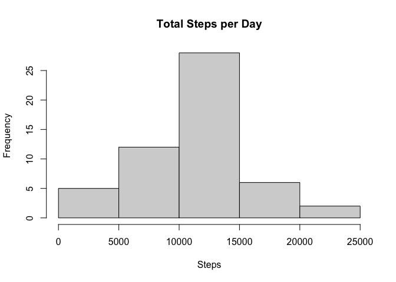
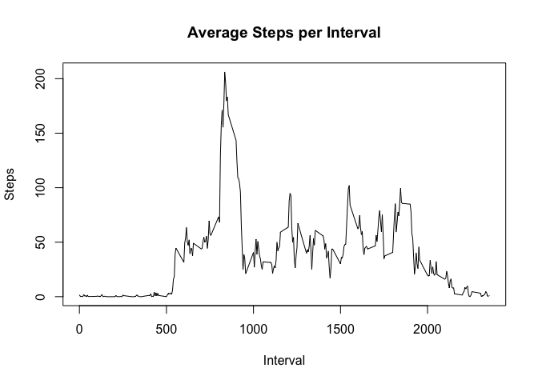
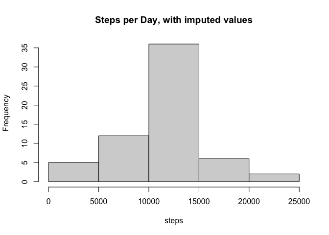
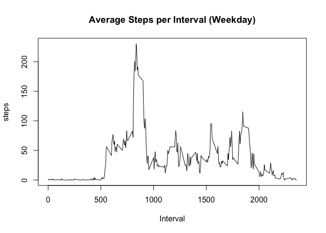
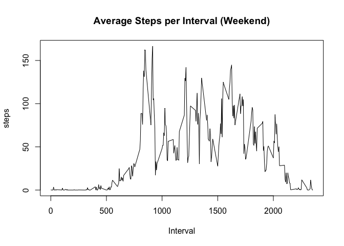

## Loading and preprocessing the data
Loading data in

```r
temp<-tempfile()
download.file("https://d396qusza40orc.cloudfront.net/repdata%2Fdata%2Factivity.zip", temp)
con<-con<-unz(temp, "activity.csv")
con<-unz(temp, "activity.csv")
data<-read.csv(con)
unlink(temp)
```


## What is mean total number of steps taken per day?
Histogram with mean number of steps/day

```r
stepsByDay<-aggregate(steps~date, data, sum)
hist(stepsByDay$steps, main="Total Steps per Day", xlab="Steps")
```

<!-- -->

Mean number of steps per day

```r
mean(stepsByDay$steps)
```

```
## [1] 10766.19
```

Median number of steps per day

```r
median(stepsByDay$steps)
```

```
## [1] 10765
```


## What is the average daily activity pattern?
Time Series graph of average steps/interval

```r
intervalSteps<-aggregate(steps~interval, data, mean)
plot(intervalSteps$interval, intervalSteps$steps, type="l", main="Average Steps per Interval", xlab="Interval", ylab="Steps")
```

<!-- -->

Return max interval

```r
intervalSteps[which.max(intervalSteps$steps), ]
```

```
##     interval    steps
## 104      835 206.1698
```

## Imputing missing values
Total missing values

```r
sum(is.na(data))
```

```
## [1] 2304
```

Imputing missing values

```r
imputeData<-data
for(i in 1:nrow(imputeData)){
  if(is.na(imputeData$steps[i])){
    intvMissing<-imputeData$interval[i]
    int_id<-which(intervalSteps$interval==intvMissing)
    imputeData$steps[i]<-intervalSteps$steps[int_id]
  }
}
```

make histogram

```r
stepsByDayImp<-aggregate(steps~date, imputeData, sum)
hist(stepsByDayImp$steps, main="Steps per Day, with imputed values", xlab="steps")
```

<!-- -->

Mean number of steps per day

```r
mean(stepsByDayImp$steps)
```

```
## [1] 10766.19
```

Median number of steps per day

```r
median(stepsByDayImp$steps)
```

```
## [1] 10766.19
```

## Are there differences in activity patterns between weekdays and weekends?
Process Data to have weekend/weekday levels and subset accordingly

```r
imputeData$date<-weekdays(as.Date(imputeData$date))
imputeData$weekendyn<-factor(imputeData$date, 
                             levels=c("Monday", "Tuesday", "Wednesday", "Thursday", 
                                      "Friday", "Saturday", "Sunday"), 
                             labels=c("Weekday", "Weekday", "Weekday", "Weekday", 
                                      "Weekday", "Weekend", "Weekend"))
imputeData$date<-data$date
weekdayData<-subset(imputeData, weekendyn=="Weekday")
weekendData<-subset(imputeData, weekendyn=="Weekend")
intervalWeekday<-aggregate(steps~interval, weekdayData, mean)
intervalWeekend<-aggregate(steps~interval, weekendData, mean)
```

Plot

```r
plot(intervalWeekday$interval, intervalWeekday$steps, type="l", main="Average Steps per Interval (Weekday)", xlab="Interval", ylab="steps")
```

<!-- -->

```r
plot(intervalWeekend$interval, intervalWeekend$steps, type="l", main="Average Steps per Interval (Weekend)", xlab="Interval", ylab="steps")
```

<!-- -->

